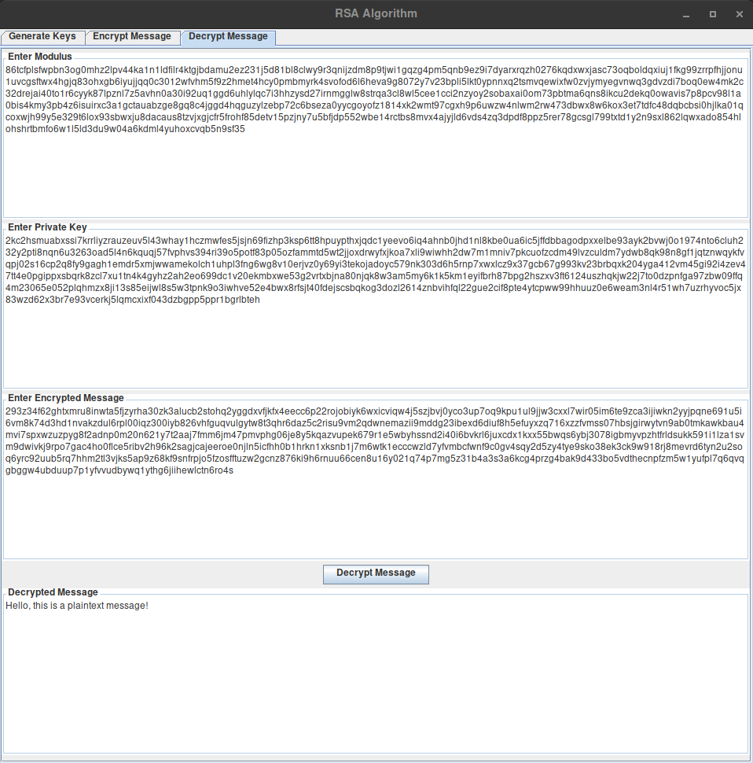

# RSA Algorithm
RSA cryptosystem for demonstrating the encryption and decryption of messages. Main purpose of this project is to demonstrate how the RSA algorithm works.

A video demonstration and explanation can be found [here](https://vimeo.com/403422627).

## Example


## How to Run
The compiler and runtime environment require minimum Java 11, and if on Windows, running from the command line requires the Java JDK to be added to the PATH environment variable.

To run the source code from command line:
```
cd src/main/java
javac Main.java
java Main
```

To run the JAR file from command line:
```
cd bin/
java -jar rsa-algorithm.jar
```

To run the EXE file from command line:
```
cd bin/
rsa-algorithm.exe
```

## How to Use
When generating the keys, the entire process of how the RSA algorithm works is logged and explained in the console. However, note that this is only viewable when running the program via the first two "How to Run" options.

After starting the program:
- Generate the modulus, public key, and private key ([example](assets/generation.png)).
- Encrypt a message using the modulus and public key ([example](assets/encryption.png)).
- Decrypt the message using the modulus and private key ([example](assets/decryption.png)).
