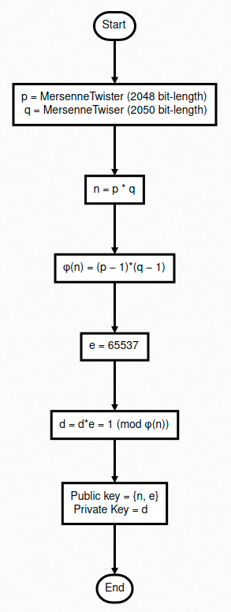
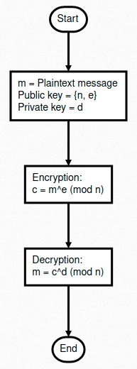
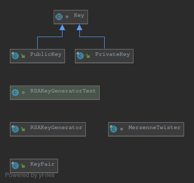
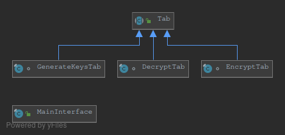
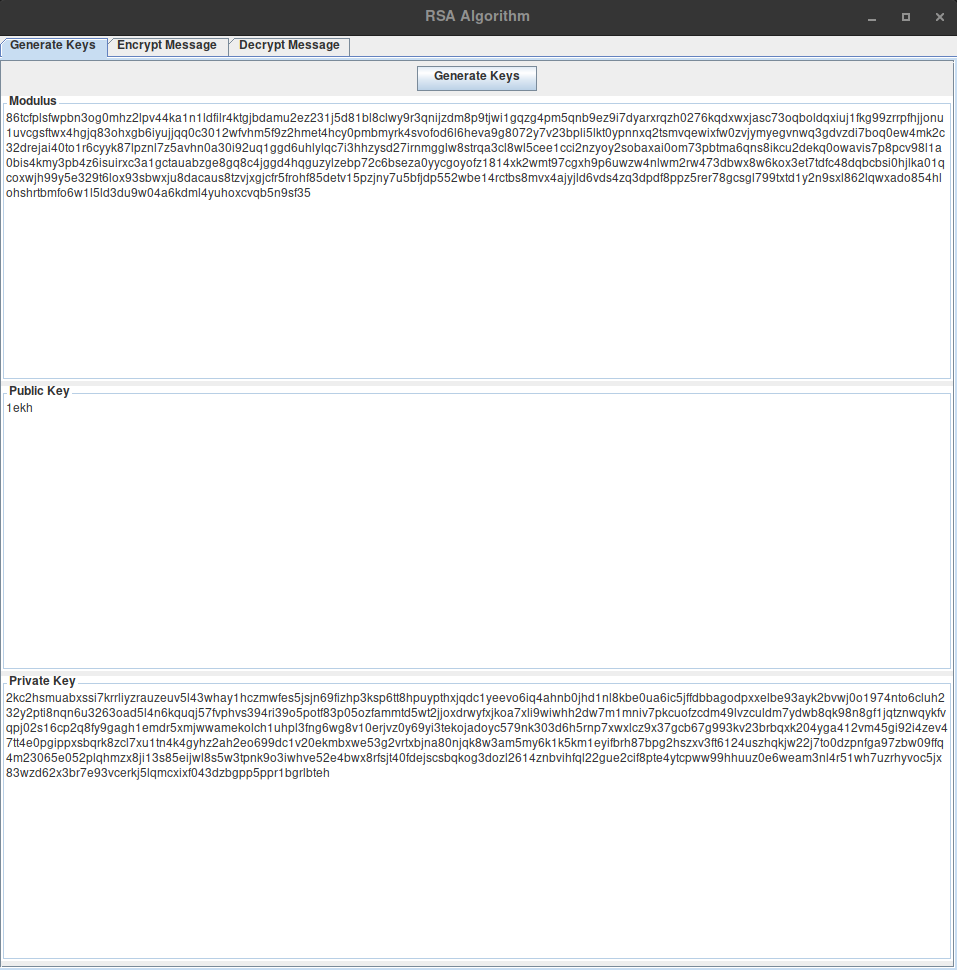
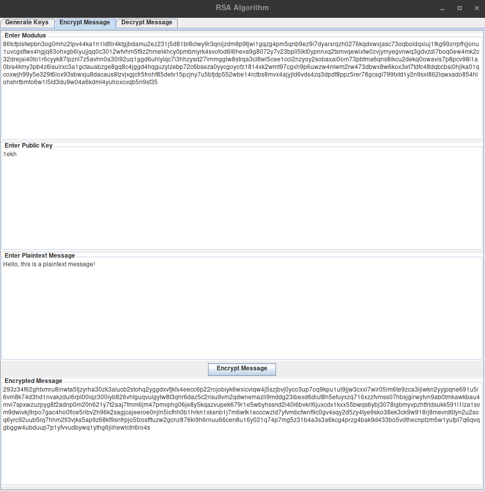
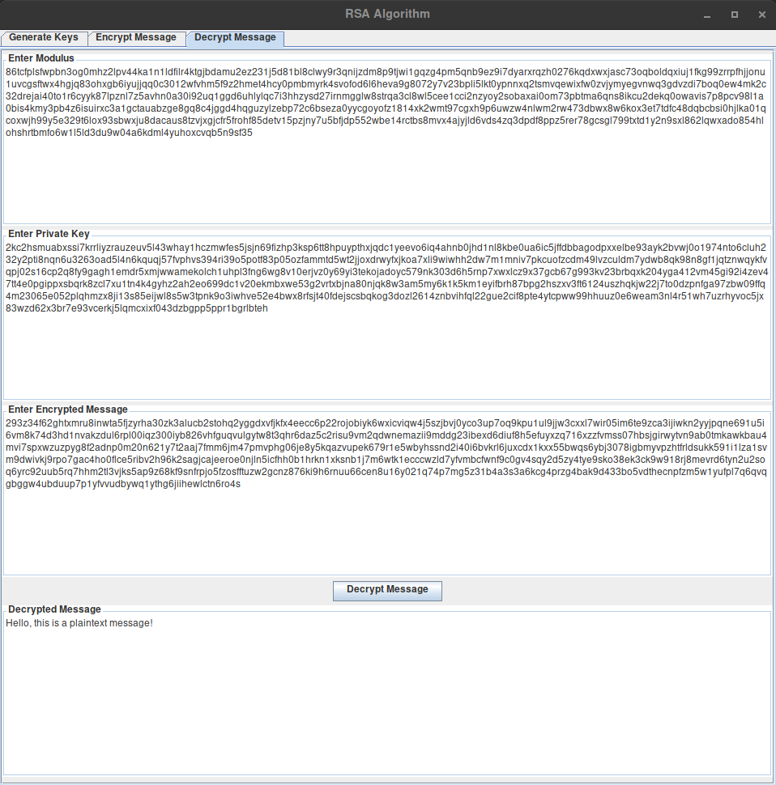

# Report
Documentation report for the RSA algorithm implemented by Louis Lefevre.

## Algorithms
### Key Generation
Before encryption or decryption can take place, we must generate a pair of keys: the public key and the private key. The public key is available publicly and shared with the world, while the private key is kept secret by its owner. The following describes the steps in detail:
- In order to generate these keys we begin by assigning variables p and q with a pair of random prime numbers of similar bit-length using the Mersenne Twister pseudo-random number generator, giving us two extremely large prime numbers. 
- The modulus, known as n, is then calculated by multiplying p by q.
- Phi, known as φ(n), is then used to store a calculated value of Euler’s totient function for n. This is done by doing p minus 1 and q minus 1, and multiplying the results.
- The public exponent, known as e, is a number that is larger than 1, smaller than φ(n), and is co-prime with φ(n). In most cases, and in many implementations of RSA, the Fermat number 65537 is used, as it always meets all the requirements listed.
- The private exponent, known as d, is calculated by finding a value that fulfils the equation d * e = 1 (mod φ(n)).  

### RSA Algorithm
Once we have the public and private key, we can use them to encrypt and decrypt a plain-text message. Either key can be used to encrypt a message, but a message cannot be decrypted with the same key it was encrypted with, only the opposite key can do that. The following describes the steps in detail:
- For encryption, you will typically want to use the public key (containing n and e). To generate the cipher-text from the plain-text, the plain-text is converted into its byte form so it can be read as a sequence of numbers. The bytes, represented by variable m, then have the equation me (mod n) applied to them, generating the cipher-text c.
- For decryption, you will typically want to use the private key (containing d). To generate the plain-text from the cipher-text, the cipher-text is applied to the equation cd (mod n), generating the plain-text in byte form. The bytes array is then converted back into text form, giving us the plain-text message back.  

## Design
### RSA Package
The RSA package contains the encryption and decryption process for the RSA algorithm, appropriately stored in the “RSA” class. Associated with this class is “RSATest”, which is used to perform tests that ensure its functionality is working correctly.  

### Keys Package
The keys package is responsible for generating the public and private key used within the RSA algorithm. The “RSAKeyGenerator” provides a static method for generating a “KeyPair”, which contains a public key, private key and the modulus. The “MersenneTwister” class is used for generating secure random numbers, to help ensure that the algorithm cannot be compromised. Lastly, the “RSAKeyGeneratorTest” class is used to perform tests that ensure the keys are generated correctly.  

### GUI Package
The GUI package is where the user interface is managed. Each child of the “Tab” class is its own individual section within the interface, and is run through the “MainInterface” class. Within that class they are appended to the tab pane within the primary frame.  

## Demonstration
### Key Generation

### Encryption

### Decryption

## Discussion
When developing this implementation I originally went with a different approach, where I would take each individual character and convert it into its ASCII form. Individually, each ASCII value would then be applied to the algorithm, returning an encrypted value that would be appended to an array containing all the entire encrypted message. However, the issue with this is that the cipher-text would always have to be stored as an array rather than a string, since in the latter form it would be impossible to tell where each ASCII value begins and ends. I also initially had issues with the random number generation used within the algorithm, as I found that when I ran tests with the same message thousands of times, a fraction of the results would be incorrect. I realised this was due to certain numbers being incompatible with the algorithm and causing it to break, which in hindsight I realise was due to the plain-text m being smaller in value than modulus n, as longer messages would cause the a higher rate of failure. This was further exacerbated by the fact that both p and q sometimes wouldn’t be of a similar bit-length. As a result, I was left with an algorithm that was only capable of processing messages only a few characters long, with an exponentially increasing failure rate.

In order to solve this issue I decided to implement the algorithm using the BigInteger Java class, which contains a variety of useful methods and functions. With this I recognised that instead of converting each individual character to ASCII, I could convert an entire message to a byte array and pass that instead, solving my first issue. Also when generating the prime numbers p and q, I was able to dictate their bit-lengths of 2048 and 2050 respectively. This made it so they would be similar in size, I could ensure they would never be the same value, and their length would improve the security of the algorithm massively. Due to the fact the primes were extremely large, modulus n was therefore also extremely large, and removed any possibility of the message being smaller in value.

Initially, I calculated the public exponent e manually by finding a value that met the conditions: e > 1, e < φ(n), and e co-prime with φ(n). However, I then discovered that in most RSA algorithms they use one of the Fermat numbers in their implementations, typically the highest known term 65537. Since using this number as the public key in all messages is essentially foolproof, I decided to adopt it myself.

## References
- [Crypto-It RSA](http://www.crypto-it.net/eng/asymmetric/rsa.html) - Key generation and RSA algorithms
- [How the RSA Algorithm Works](https://www.youtube.com/watch?v=Z8M2BTscoD4) - Explanation of RSA algorithm process
- [Fermat Numbers](https://en.wikipedia.org/wiki/Fermat_number) - Fermat numbers terms
- [Mersenne Twiser](https://cs.gmu.edu/~sean/research/mersenne/MersenneTwisterFast.java) - Source code for Mersenne Twister pseudo-random number generator
- [Encryption RSA](https://jeremykun.com/2011/07/29/encryption-rsa/) - BigInteger implementation theory
- [Flowchart.js](http://flowchart.js.org/) - Flowchart generation
